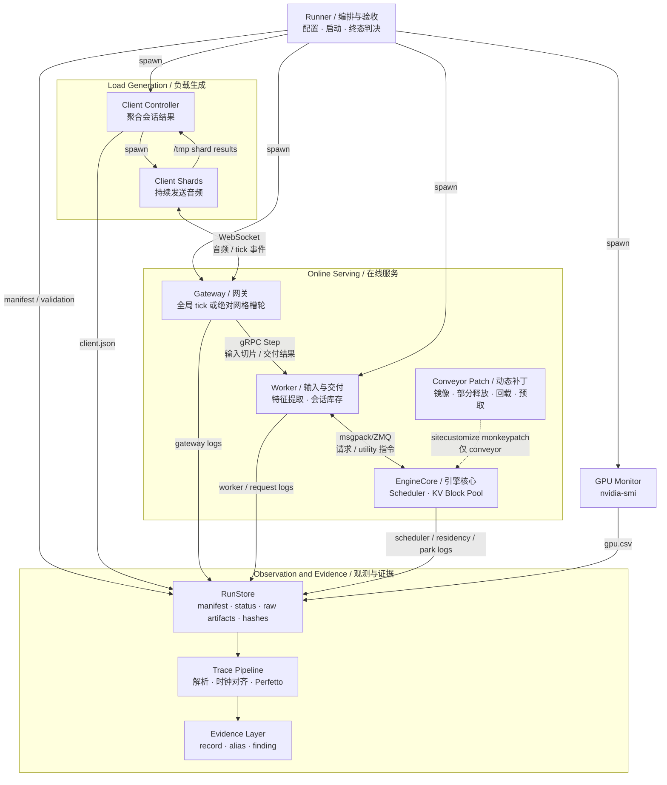

# System

## Design Goals

系统在普通 vLLM serving 接口之外恢复四类结构信息：tick 相位、下一次 KV 使用时刻、injection 可延性以及 commit/cancel 语义。当前实现首先闭合前两类，并为后两类保留协议位置。

设计遵循以下不变量：

1. 每个前台会话保持原始 context，不用有损窗口换容量；
2. 每个会话自身的逻辑周期保持为 `T`，相位调整只改变周期内位置；
3. 交付和生成解耦后，两端长期速率必须精确配平；
4. 回收 KV 尾部必须发生在 idle 状态并显式记录镜像覆盖率；未覆盖尾部只能退化为重算，不能静默伪装成成功回载；
5. 提前回载 KV 尾部只能改变延迟，不能改变正确性；拒绝、迟到或被 LRU 逐出的提前回载必须退化为请求到达后再回载；
6. warm start 是测量前的状态构造，不能和 tick 或 KV 尾部回收交错；
7. 每个机制必须有独立观测事件，未加载的 patch 必须硬失败，不能生成“看似正常”的证据。

实验配置和当前量化结果分别由 [`Experiments`](experiments.md) 与 [`Findings`](findings.md) 持有，本文不复制性能数字。

## System Topology



主请求路径是 `Client Shards → Gateway → Worker → EngineCore`；runner 只负责配置、启动和验收，不进入在线数据面。所有进程同时把原始观测写入同一个 run，离线 trace 与 evidence 只能由这些不可变 artifact 派生。

仓库沿 process boundary 分为三轴：

| 维度 | 职责 |
| --- | --- |
| `engines/` | 真正被 spawn 的 gateway、worker 和 EngineCore patch |
| `experiments/` | 可执行配置、runner、fairness constants 和 validation |
| `infra/` | 运行、环境、观测与离线解析的共享设施 |

精确组件、source path 和 symbol 由 [`system-map.json`](agent/system-map.json) 持有；跨进程和运行时绑定由 [`dynamic-edges.json`](agent/dynamic-edges.json) 持有。本文只解释它们形成的系统语义。

## Experimental Arms

### Baseline Arm

baseline 保留 metronome 式 vLLM-realtime 行为：每个 session 是持续的 resumable request，gateway 按全局 tick 推进会话，KV 在 GPU pool 中持续增长。pin 内 `vanilla` 是参考 target；正式跨臂测量使用 `paringest`，它只修复 host-side input processing、记录逐会话 delivery completeness 并加入统一观测，不改变默认 KV residency 语义。

baseline 的作用是观察现有栈在相同模型、负载和仪器下如何接近 capacity wall。它不是一个静态不可维护目录，但任何行为变化都必须以对照公平为理由，并记录在协议中。

### Conveyor Arm

conveyor 在相同 workload 和模型上增加四个机制：

| 机制 | 直观含义 | 所属层 |
| --- | --- | --- |
| 错开相位（phase staggering） | 保持每路周期不变，把不同会话分散到周期内不同时间点，避免同步拥堵 | Gateway |
| 取现货交付（take-from-stock delivery） | tick 到来时先交付上一周期已生成的库存，不让网关等待本周期 GPU 计算 | Worker |
| KV 部分释放（park） | 会话空闲时只保留固定 KV 底座，释放可由主机镜像恢复的尾部 | EngineCore |
| KV 预取（prefetch） | 在真实请求进入 EngineCore 前提前搬回已释放尾部，隐藏请求路径上的回载延迟 | Worker + EngineCore |

这四项改变的是 gateway 发射、worker 交付语义和 EngineCore residency 生命周期；它们不改变 client 生成的输入负载。每项机制当前验证到什么程度只看 [`Findings`](findings.md#current-state)。

按需回载（demand reload）指真实请求到达后才恢复缺失的 KV 尾部；它是预取缺失、迟到或失效时的正确性回退路径。

## Phase Staggering

错开相位（phase staggering）解决“所有会话同时开始工作”的惊群问题。baseline 的同步 tick 会让多路会话在同一时刻进入特征提取（feature extraction）和引擎；conveyor gateway 把周期划成 slot，并给每个会话分配稳定相位：

```text
session i fires at t0 + phase(i) + kT
```

gateway 使用绝对时间网格。一次晚醒只影响本次发射，下一拍仍回到 `t0 + k·slot_period`，不会因为重新锚定而累积漂移。

相位机制只控制发射时刻，不改变每个会话的逻辑周期，也不依赖引擎理解 deadline。它把“batch 由偶然到达决定”改为“到达结构由 gateway 显式安排”。

## Take-From-Stock Delivery

取现货交付（take-from-stock delivery）把“本次计算”和“本次交付”解耦。如果 worker 的 `Step` 等待本片计算完成，单个慢会话会在 gRPC 服务锁后重新串行化已经错开的 slot；conveyor 因而把交付和生成拆成流水线：

```text
tick k push input(k) and deliver inventory(k-1)
background compute produces inventory(k)
```

代价是稳定的一片 pipeline latency；收益是 gateway 发射节拍不再等待 GPU 完成本片。

这一语义要求两个强约束：

- 每段生成量必须与每周期消费量精确相等，否则库存会无界增长，内容不断陈旧；
- client-side request latency 不再包含 GPU 等待，不能用作计算延迟指标。

因此健康性由 delivery quota、inventory depth 和 trace-side latency 联合定义，而不是由 `Step` latency 单独定义。

## KV Lifecycle

### States

会话 KV 的控制状态分为：

| 状态 | 含义 |
| --- | --- |
| `resident` | registry 当前没有待处理的 KV 部分释放或匿名具现化；它不是“所有块已在 GPU”的证明 |
| `parked` | 已部分释放：只保留 resident floor，尾部可由主机镜像恢复 |
| `materializing` | 尾部正在匿名搬回 GPU prefix cache，尚未完成 |

registry 只保存控制阶段、时序和延迟队列；块是否真实 resident 的最终事实仍由 vLLM block pool 持有，不能在 patch 中复制第二份块级真相。当前 `on_claimed` 在新 chunk 到达 scheduler 时就把控制状态置回 `resident`，早于按需回载或重算完成；因此诊断真实 readiness 时必须联合 live block classification、request status 与 `L/R` 事件，不能单看 lifecycle 标签。

### Mirror

vLLM connector 对新完成的完整 KV block 做增量主机镜像（host mirror）。镜像是 write-through copy：它不会释放 GPU block，只为未来的 KV 部分释放提供可恢复副本。已经镜像过的历史尾部不应在每个周期重复复制。

### Park

KV 部分释放（park）发生在会话完成本段 decode 并转入 idle 的瞬间。EngineCore 内的 auto-park hook 会：

1. 释放 request 对 KV block 的持有；
2. 保留固定 resident floor；
3. 按 resident floor 和 tail margin 选择可逐出的 prefix-cache 尾部；
4. 记录释放前后 residency 和 mirror coverage。

它发生在 scheduler 的停止状态转移中，因此与调度串行，不依赖 worker 猜测“本段何时算完”。当前实现不会先用 host coverage 截断 evicted set，而是保留最新 tail margin、事后记录 `cpu_covered`；覆盖缺口会在 resume 时退化为重算。

离线 Perfetto 会把超过阈值的 historical prefill 标成 `LARGE`，但当前 runner 不会据此自动把 `status.json` 判为 failed，所以正式采用 run 前仍需人工检查这一指纹。同步调度是当前 KV 部分释放正确性的前提；异步在途步骤会形成 use-after-free 窗口。

### Demand Reload

下一片到达时，scheduler 先认领仍在 GPU cache 的底座，再通过 connector 按内容 hash 恢复缺失尾部。恢复完成后才进入正常 prefill。若出现大段历史重算，说明镜像、KV 部分释放或 hash-match 链路至少一处失效。

### Prefetch

KV 预取（prefetch）把具现化（materialization）从“FE 完成后的按需路径”提前到 input push。传输层匿名搬运内容块，完成后按原 hash 注册到 GPU prefix cache；真正的 request 仍通过 vLLM 既有 hash-match 路径认领，认领层不需要理解预取。

池空间不足时，回载进入延迟队列，由后续 KV 部分释放事件驱动重评；若真实 chunk 已经认领内容，对应延迟预取必须取消。任何预取失败都回退到按需回载，不能改变请求结果。

## Warm Start

seed 模拟“会话开始测量时已经拥有长 context”，不是普通 tick。正确顺序是：

1. 预建所有 session；
2. 完成全部 seed prefill；
3. 在此期间挂起自动释放（auto-park）；
4. seed 输出不进入可交付库存；
5. 所有 session ready 后才启动 gateway/client tick；
6. 第一周期允许全驻留运行，首次正常自动释放自然进入稳态。

seed 刚结束时不能主动做收尾释放，因为 host mirror 的发起和完成都依赖调度进度，结构上不能保证已经覆盖完整 seed。相关机制结论见 [FINDING-H6](findings.md#finding-h6)。

成功路径上 ready file 只在全部 seed 完成后写入。当前 worker 的 300 s barrier timeout 会记录错误后继续启动服务；共享 worker-fatal scanner 把该日志视为 validation issue，因此这种 run 可以留下诊断 artifact，但不能进入正式证据。

## One Session Cycle

下表是代码、日志和 Perfetto 的共同读图顺序。健康条件只描述不变量，不保存当前 run 的测量值。

| 阶段 | 动作 | 可观测证据 | 健康不变量 |
| --- | --- | --- | --- |
| 槽位触发 | gateway 在绝对网格发射本会话 | `gateway_ticks.log` | 周期不漂移，slot 顺序稳定 |
| 交付 | worker 接收 input 并立即返回库存 | `P` event、`deliv` | 稳态交付达到 quota |
| 特征提取 | input 进入线程池并生成模型特征 | `IQ/IS/IE/IR/IA` | queue、FE、handoff 可分解 |
| 引擎准入 | 音频特征追加到 resumable request | scheduler/per-request events | request ID 与 session 一致 |
| 具现化 | 预取已完成则直接认领，否则按需回载 | park `L/R` events | 缺失尾部最终可恢复 |
| Prefill | 只计算本片新增输入 | scheduler multi-token step | 稳态不重算完整历史 |
| Decode | 生成下一片库存 | scheduler single-token steps | 生成与消费速率配平 |
| 空闲转换 | 段配额完成、session 暂时 idle | scheduler state、`run=` | 会话不死亡、不遗失 |
| 镜像 | 新完整 block 增量复制到 host | park `S` event | 只推进新增 mirror frontier |
| 部分释放 | scheduler 停止转移中释放尾部 | park event、residency counter | resident floor 有界、可恢复 |

## Failure Semantics

| 故障 | 可观测指纹 | 必须采取的响应 |
| --- | --- | --- |
| 交付饥饿 | paringest worker 的 `delivery`、conveyor gateway 的 `deliv < quota` / `[starve]` | 首次足额前允许 TTFA ramp，但每个会话必须在 run 内至少足额一次；之后欠额则 validation 失败；vanilla 仅作参考 |
| 库存漂移 | `inv_backlog` 随时间增长 | 修复生成/消费配平，不能只豁免指标 |
| 回载退化为重算 | tick 期出现 large historical prefill | 检查 mirror coverage、hash 与 patch |
| 镜像缺口 | evicted 远大于 covered | 当前实现会重算；该 run 不得证明完整 reload，需修复 coverage 或前置 guard |
| 会话死亡 | worker 出现 session-ended/fatal | 即使 cadence 正常也判失败 |
| 槽位漂移 | gateway late/period 持续偏离 | 检查绝对网格和阻塞段 |
| 补丁缺失 | 必需事件或 artifact 缺失 | EngineCore exit 78，禁止产证据 |
| 预取压力 | pool budget 不足 | 延迟或取消，回退到按需回载 |

完整 validation 字符串契约属于局部 `AGENTS.md` 和 [`contracts.json`](agent/contracts.json)。

## Observability Model

两臂必须使用同一套 observation producer：

- worker 产出 KV、per-request、per-iteration 与 ingest 事件；
- EngineCore patch 产出调度、驻留、KV 部分释放、镜像、回载和预取事件；
- gateway 产出真实发射时刻与交付量；
- GPU monitor 旁路采样设备状态；
- trace bundle 使用显式双时钟配对统一 perf 和 epoch 时钟；只有旧 run 才允许启发式回退，并必须标记偏差。

Perfetto 的 scheduler slice 是相邻调度调用之间的调度轴，不等同 CUDA execution timeline。仪器没有提供的分辨率不得通过绘图推断出来。详细格式和读图陷阱见 `infra/trace/AGENTS.md`。

## Extension Points

新增实验时复用同一形状：

```text
engines/<arm>/                   worker and optional gateway
experiments/<arm>/__main__.py    argv translation
experiments/<arm>/config.py      arm-private behavior
experiments/<arm>/runner.py      RunPlan declaration
experiments/shared/              fairness constants
```

runner 只声明命令、环境、required artifacts 和 issue scanner；生命周期、看门狗、终态和不可变 artifact 由 `infra/run/` 统一实现。新 arm 必须继续复用同一 client 和 shared workload，除非实验问题本身明确改变负载，并在协议中声明不可直接比较。

精确修改步骤见 [`run-experiment.md`](agent/tasks/run-experiment.md) 和最近一层 `AGENTS.md`。
