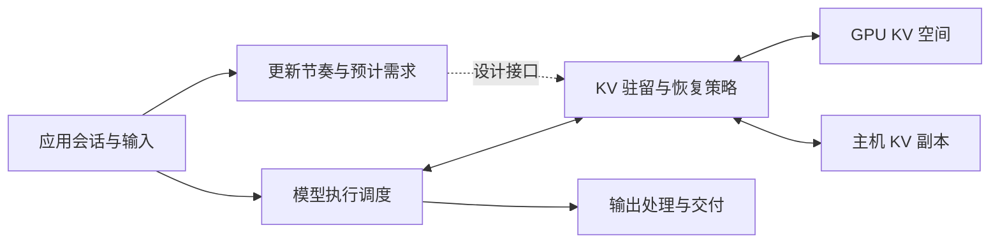

# 系统设计：时序感知的 KV 驻留与恢复

## 设计目标与总览

Pilarius 探索如何利用周期负载预先给定的下一次使用时刻（[问题定义](problem.md#why-timing-information-matters)），在更新间减少 GPU KV 驻留，并把恢复安排到后续计算需要之前。把这份信息转化为容量收益，设计需要同时处理三个挑战。(1) **需求落在周期的哪个位置**：时间信息是每会话的，资源是共享的；若各会话的周期需求相位对齐，恢复期限与活跃驻留在时间轴上同时叠加，链路与 GPU 峰值随会话数上升；单会话的可预测性不自动带来多会话的可行性。(2) **空闲期回收多少**：回收驻留要求移除 GPU 内容，参考语义却要求被移除的状态在下次使用前完整重建；逐出的合法域、深度与副本有效性必须可判定，而建立副本本身消耗同一条传输链路。(3) **使用前何时恢复**：恢复过晚即回到关键路径，退化为事后触发的按需恢复；过早则重新占用刚回收的空间并与其他会话竞争传输；就绪时机落在两侧都有代价的窗口内，且实际执行时刻仍受排队与批组成扰动。三个挑战共享同一资源耦合：偏移指派同时决定各会话的链路时间份额、空间占用时长与批组成（→ [资源边界](problem.md#resource-frontier)）。它们也分别对应利用时间信息三级所须付出的代价：回收只依赖节奏存在，恢复时机还需释放时刻可见，需求安置则以偏移可控为前提（→ [时间信息的机会与代价](problem.md#why-timing-information-matters)）。

围绕这些挑战，候选设计将空闲状态回收与后续状态准备联系起来：当前更新结束后，策略依据访问引用和有效主机覆盖判断哪些 GPU 内容可以回收；下一次使用之前，策略结合预计需求与资源压力安排恢复；若应用允许指定更新位置，接纳时为会话指派的释放偏移即可改变多个会话需求的重叠。上述过程需要共同维护内容有效性和空间占用，并在预取未完成时协调正常恢复。这是设计总览而非已实现的统一调度器，当前执行路径的差异见 [实现边界](#implementation-boundary)。

> **【关键 · 定义】** 候选设计将空闲状态回收与后续状态准备联系起来：回收依据访问引用与有效主机覆盖，恢复依据预计需求与资源压力，释放偏移仅在应用允许时于接纳一次指派、此后不再移动；这是设计总览，不是已实现的统一调度器。

以下设计要求刻画该过程成立的条件；完整实现及并发正确性仍需验证：

1. **历史语义保持。** KV 管理不主动截断参考执行保留的逻辑上下文。参考执行需固定相同输入、生成保留规则和模型配置。
2. **时序合法。** 更新偏移只在应用允许的范围内设定，等待与缓冲计入相应服务指标。
3. **安全回收。** 执行和传输仍持有的块不能被回收或错误复用；会话进入 idle 只是必要检查之一。
4. **就绪后使用。** 依赖 KV 的模型计算只能读取有效的 GPU 内容；分配目标空间不代表恢复完成。
5. **可恢复性明确。** 每个缺失范围根据有效主机覆盖选择回载或重算；失败必须可观测。
6. **预取可回退。** 预取未能及时准备状态时，正常恢复路径仍应成立；重复传输、释放和缓存命中必须协调。
7. **资源完整记账。** 活动状态、缓存、在途传输目标及主机副本都计入资源消耗。

是否已经满足这些要求，以及性能证据的范围，见 [Findings](findings.md)。

这些要求由以下逻辑组件共同承担：

虚线表示候选设计所需的信息接口，不表示当前执行路径已实现基于未来释放时间的预取。逻辑组件不规定进程数或通信协议。

在该架构上，三个候选机制与三个挑战一一对应——释放偏移调度回应需求安置，带主机后备的部分逐出回应回收判定，KV 预取回应恢复时机：

| 候选机制 | 因果假设 | 必须回答的问题 |
| --- | --- | --- |
| 释放偏移调度 | 分散会话需求可能降低驻留或恢复的瞬时峰值 | 应用是否允许调整？批处理损失是否抵消收益？ |
| 带主机后备的部分 KV 逐出 | 空闲期间减少驻留可为其他会话释放空间 | 副本是否及时可用？恢复与重算代价是否满足服务目标？ |
| KV 预取 | 利用预计需求提前准备状态可能减少关键路径等待 | 提前量是否充足？容量竞争、无效预取和再次逐出代价如何？ |

这些是待检验的机制假设。

把组件与机制放回一个会话的时间线上，逻辑依赖如下（不要求所有阶段严格串行）：

1. 获得应用节奏信息，估计后续状态需求；具备条件时提前准备。
2. 输入达到释放条件并实际提交；记录两者的偏差。
3. 引擎接纳或排队该更新，确定所需历史。
4. 通过 GPU 复用、主机回载或重算准备状态；依赖内容就绪后才执行相关计算。
5. 模型推进，产生新状态和输出；备份与输出交付可以分别异步推进。
6. 当前状态不再被执行访问后，依据引用、覆盖和容量策略选择逐出。

周期性只是第一步可用的信息之一。当前实现使用的具体触发点见[实现边界](#implementation-boundary)，不能把设计时序视为已实现的精确调度。

## KV 状态模型

上述机制假设能否成立，首先取决于系统对状态的区分是否足够精确；后续各机制卡的决策输入与正确性条件都建立在本节的状态区分之上。KV 状态需要按块和引用描述，而不能简化为“会话在 GPU / 会话在主机”二选一。

| 维度 | 需要维护的信息 | 对决策的作用 |
| --- | --- | --- |
| 会话活动 | 等待、执行及其对块的访问 | 判断是否存在可回收时机 |
| GPU 分配 | 物理块、容量与持有引用 | 防止复用仍被执行或传输占用的空间 |
| GPU 内容 | 内容身份、有效范围、是否就绪 | 决定哪些历史可以直接使用 |
| 主机覆盖 | 已完成且有效的副本集合 | 决定哪些缺失范围可直接回载 |
| 传输 | D2H/H2D 的计划、在途、完成和失败 | 管理依赖及双向资源竞争 |
| 缓存复用 | 索引可见性、共享引用、可替换性 | 区分可查找到状态与保证其持续驻留 |

物理状态以 allocator、传输完成事件和运行时引用为依据。一个存储 cursor 只能表示进度，不能证明它之前所有块都有已完成副本。覆盖可以有缺口；GPU 与主机副本也可以同时存在。

一次典型的降驻留过程说明这些维度为什么必须分开维护。GPU 内容仍有效时，建立主机副本会增加一份存储与传输依赖，并不立即释放原有空间；只有副本完成并且相关访问引用允许回收时，策略才能选择逐出；恢复则先占用目标空间，再使内容就绪并发布可复用状态。因而，分配、内容有效与索引可见分别影响容量检查、读取安全和缓存复用。若策略允许对无副本范围逐出，该分支依赖根据保留历史重算；其精确前置条件、共享引用与取消行为仍待设计，本例不能替代并发证明。

## 释放偏移调度

释放偏移决定多会话需求的重叠结构（沿用[周期模型](problem.md#periodic-interaction-session)）；它只在应用允许时才是控制量，其收益必须扣除批处理变化与用户等待代价。

| 字段 | 内容 |
| --- | --- |
| 针对的挑战 | 多会话周期需求的相位重叠使驻留峰值与恢复突发叠加（设计挑战 1：需求落在周期的哪个位置） |
| 决策输入 | 应用时间契约（偏移权限，迟到、跳过或合并更新的规则）、会话周期、共同参考时间 |
| 动作 | 为会话选择稳定偏移，按共同参考时间计算后续更新目标；调度迟到不通过逐次相对计时无限积累漂移。偏移在接纳时一次指派，会话生命周期内不再移动；会话集合的变化通过 slot 的占用与释放吸收（见下） |
| 合法性与计量 | 时序合法（设计要求 2）。必须区分两种控制：对已产生输入推迟提交会增加排队时间；调整应用切块边界会改变块内输入等待。两者都不能仅凭释放到完成的指标宣称没有用户代价 |
| 代价与失败模式 | 分散释放改变批形状与资源重叠：可能降低峰值，也可能增加迭代次数、权重访问与缓存替换；相同输入 token 数不保证相同 GPU 工作或恢复字节 |
| 当前选择 / 未决 | v1 采用均匀偏移 slot 网格：周期除以 slot 数得偏移间隔，新会话占用空闲 slot，并同时充当消融基线。异构上下文长度不通过调整偏移吸收，而由恢复深度吸收——每会话按其偏移窗口的搬运预算决定逐出与恢复的量，状态量大的会话保留更多驻留；需求成比例间距与动态再指派悬置为备选（理由见[资源侧推论](#offset-resource-rationale)）；迟到处理未决（→ [未决设计决策](#open-design-decisions)） |
| 实现与证据状态 | 绝对目标网格已实现，同步等待可推迟实际提交（→ [实现边界](#implementation-boundary)）；输入侧诊断与资源取舍假设的证据状态见 [Findings](findings.md#current-state) |

外生且不可调整的释放仍可供状态准备使用，但不能被当作自由控制量；不预设均匀偏移最优，也不将示意中的互不重叠窗口推广到高负载。

会话加入或退出会使既有偏移分布失配：N 个会话的均匀偏移无法直接容纳第 N+1 个。v1 以固定 slot 网格回避迁移：偏移间隔预先划分为 slot，加入即占用空闲 slot，无空闲 slot 则拒绝接纳——会话接纳由此归约为 slot 可用性判定；退出在会话完整结束后释放 slot，既有会话的偏移在其生命周期内不再移动。该选择使首次提交的对齐等待成为会话生命周期中唯一的偏移扰动，这正是延迟基准取实际提交的前提（见[工作负载模型](problem.md#workload-model)）。迁移类策略（全局重排、有界增量迁移）悬置为备选扩展，不进入当前设计路线（理由见[资源侧推论](#offset-resource-rationale)）。

slot 数由配置推导而非自由设定，但其闭式尚不可写，原因是相关量相互耦合：slot 越密，偏移间隔越短，单窗口可搬运的字节越少，可逐出深度随之变浅，单会话的驻留均值因此升高——平均驻留是 slot 数的函数而非独立输入，空间、带宽与计算三类约束不能各自独立求解后取最小。推导所需的输入包括：周期 `T`、传输服务曲线（含双向干扰）、可用 GPU KV 池、单会话每周期计算量及其批形状依赖、负载各输入与生成侧的上下文上限（决定状态增长的地平线与会话可服务时长）。该联立可行性系统的求解属于资源模型的任务（→ Q5），公式留待标定后给出；其求解除可行 slot 数外，还应输出对应的回收总量与承载扩展比例，供 Q5 标定与留出验证使用。

释放偏移的资源侧推导本体由[资源边界](problem.md#resource-frontier)持有，本节不重复推导，只保留支撑上述设计选择的推论。第一，一阶模型下，只要每会话的逐出深度以其偏移窗口的搬运预算为上界，回收总量即由链路预算决定、与份额在会话间的分布无关——该不变性是一阶模型下的推论，待 Q5 标定检验；由此，重新分配偏移不改变回收总量，只重分各会话的驻留余量，而重新指派须以推迟提交或调整切块落实、引入可感知的时序扰动，需求成比例间距与动态再指派因此悬置为备选。第二，状态量小于窗口预算的会话留下的链路空闲，可被相邻需求机会性利用。第三，在该视角下，预取排序在各自区间内近似退化为按期限先后服务，跨会话竞争成为需求溢出区间时可检测的例外。GPU 空间维度的错峰论证同由[资源边界](problem.md#resource-frontier)持有，偏移与驻留策略相互放大的假设待 Q4 消融。该视角不消除既有约束：同一偏移选择也改变批组成，三类耦合资源之间的权衡仍属未决设计（→ [未决设计决策](#open-design-decisions)）。

## 部分 KV 逐出

部分逐出机制由三个环节组成：主机后备提供可回收的前提，空闲逐出实施回收，按需恢复作为回退路径处理缺失。

### 增量主机后备

主机副本是安全逐出的前提之一，但复制本身不回收 GPU 空间；它提供的是后续决策依赖的有效覆盖。

| 字段 | 内容 |
| --- | --- |
| 针对的挑战 | 被移除状态的可重建性依赖有效副本覆盖（设计挑战 2 的前提环节） |
| 决策输入 | 新产生的 KV、传输状态、主机容量 |
| 动作 | 随状态产生异步建立主机副本；区分尚未完成、传输在途与已确认覆盖 |
| 正确性条件 | 恢复决策使用当前有效覆盖：主机容量不足引起的副本替换会使历史备份失效（设计要求 5、7） |
| 代价与失败模式 | 主机容量占用、D2H 流量与在途引用；GPU 使用量另随模型增长、目标分配、缓存替换和逐出变化，应分别记账 |
| 实现与证据状态 | 已有路径；存储 cursor 只表示进度，不证明其之前所有块都有已完成副本（→ [KV 状态模型](#kv-state-model)） |

### 空闲会话逐出

若空闲区间与逐出深度的假设成立，空闲期回收驻留可成为容量收益的直接来源；其安全性由引用检查与副本确认共同保证，其收益上限由保留前缀与共享块决定。

| 字段 | 内容 |
| --- | --- |
| 针对的挑战 | 回收驻留须同时满足语义可重建与合法域、深度可判定（设计挑战 2：空闲期回收多少） |
| 决策输入 | 会话活动与访问引用、已确认主机覆盖、容量压力、保留前缀参数 `K` |
| 动作 | 确认目标状态不再被当前执行访问 → 解除相应请求引用 → 选择仍可安全回收的物理块 → 保留策略前缀 → 回收其余选定空间；共享块及在途传输引用单独检查 |
| 正确性条件 | 安全回收（设计要求 3）、可恢复性明确（设计要求 5） |
| 代价与失败模式 | 恢复流量与缺口重算；`K` 是容量与下次恢复代价之间的策略参数，不保证整个会话只占 `K` 个块，也不保证前缀不被之后正常替换；尾部余量和共享块影响实际分配量 |
| 当前选择 / 未决 | v1 逐出尾部、保留前缀，深度以偏移窗口内可回搬量为上界（一阶近似为 `B ×` 窗口，实际以标定的传输服务曲线为准）；v1 只逐出已有确认副本的块，允许无副本范围重算保留为扩展（→ [未决设计决策](#open-design-decisions)） |
| 实现与证据状态 | 主路径经 idle transition 已实现；固定尾部余量未与确认覆盖求交（→ [实现边界](#implementation-boundary)）；语义审计与驻留观察的证据状态见 [Findings](findings.md#current-state) |

### 按需恢复

按需恢复是预取缺席或失败时的正常恢复路径；其语义正确与及时完成是两个独立性质，必须分别验证。

| 字段 | 内容 |
| --- | --- |
| 针对的挑战 | 就绪时机两侧都有代价且执行时刻受排队扰动（设计挑战 3 的回退面） |
| 决策输入 | GPU 有效状态、已确认主机覆盖、保留的参考输入与生成历史 |
| 动作 | 确定可直接使用的 GPU 状态 → 确定可由主机回载的缺失范围 → 对无法回载的缺口按保留历史重算依赖后缀 |
| 正确性条件 | 就绪后使用（设计要求 4）、可恢复性明确（设计要求 5）；重算保持语义要求原始参考输入及所需生成历史仍然可用，且执行不读取未完成内容 |
| 代价与失败模式 | 传输与重算进入关键路径并可能排队，语义正确的恢复仍可能错过服务目标。对只支持连续前缀复用的执行路径，首个无法恢复的缺口迫使其后依赖后缀一起重算，缺口之后的 GPU 副本不一定可被该接口利用；重算范围由缺口位置与接口复用能力决定，一般情况下不存在未经条件限定的“一块重算上界” |
| 实现与证据状态 | GPU 连续前缀 + 主机回载 + 缺口重算的组合路径已经源码审计；恢复等待的关键路径观察与证据状态见 [Findings](findings.md#current-state) |

周期内的计算余量为恢复提供一条保留的扩展路径。模型无法处理尚未产生的未来输入；已到达输入能否提前处理、输出能否预生成，由具体更新契约决定（见[交互会话及其时间结构](problem.md#interaction-sessions-and-their-timing)）。在这些工作之后仍有余量时，已存在的历史输入可用于重算部分历史 KV：以计算换显存，与以带宽换显存正交且可叠加。v1 不引入该机制；引入前需补重算的正确性条件、成本模型及其对 KV 空闲区间的影响（→ [未决设计决策](#open-design-decisions)）。

## KV 预取

若提前量充足，预取可把状态准备移出关键路径；该提前量必须覆盖从提交到再次获得执行机会的完整依赖链，而不只是传输本身。恢复带宽与恢复关键路径时长不是同一个量。

| 字段 | 内容 |
| --- | --- |
| 针对的挑战 | 恢复过晚回到关键路径、过早占用空间并竞争传输（设计挑战 3：使用前何时恢复） |
| 决策输入 | 预计需求时间、缺失字节与有效主机覆盖、当前 GPU 分配、竞争需求、传输成本估计 |
| 动作 | 检查覆盖与容量 → 保留必要引用并分配目标 → 提交传输 → 完成后发布有效内容 → 使用时重新确认状态 |
| 正确性条件 | 预取可回退（设计要求 6）、就绪后使用（设计要求 4）：容量不足则延后；输入先到则与按需恢复协调；完成后又被逐出则按普通缺失处理 |
| 代价与失败模式 | 提前占用目标空间、无效预取与重复传输；提前量不足时退化为按需恢复 |
| 当前选择 / 未决 | v1 触发为空间门控：前序会话逐出释放目标空间后即可发起，slot 网格下按期限先后排序。提前量为可调参数——更早发起延长占用窗口、抬高驻留均值（见[资源边界](problem.md#resource-frontier)），取值留敏感性实验。实现现状：输入 push 触发已实现，基于未来网格的预取未实现，两者必须作为不同实验条件（→ [未决设计决策](#open-design-decisions)、[实现边界](#implementation-boundary)） |
| 实现与证据状态 | 源码路径存在：目标先分配、传输完成后发布索引（证据状态见 [Findings](findings.md#current-state)）；并发验证与净延迟收益缺（→ [实现边界](#implementation-boundary)） |

## 未决设计决策

各策略的 v1 规则已定——均匀 slot 网格、偏移接纳时一次指派且终身固定、尾部逐出、空间门控预取；需求成比例间距与动态再指派已悬置为备选（理由见[资源侧推论](#offset-resource-rationale)）。下表集中列出仍未决的问题、作出决定所需的材料，以及在决定并验证之前不成立的主张。

| 待决问题 | 需要补充的内容 | 不能提前写出的主张 |
| --- | --- | --- |
| slot 数怎样由配置推导 | 联立可行性系统的求解：slot 密度—窗口搬运量—逐出深度—驻留均值的耦合、批形状对单周期计算的影响、双向传输修正；输入为周期、传输服务曲线、KV 池与各输入与生成侧上下文上限 | 各资源天花板可独立计算后取最小——平均驻留是 slot 数的函数，不是独立输入 |
| 迟到输入的处理 | 迟到对 slot 网格与后续更新目标的影响、推迟提交的计量、恢复窗口的相应收缩 | 迟到不影响服务判定或不占用后续窗口 |
| 逐出深度的精确规则 | 实测传输服务曲线对一阶带宽预算的修正、选择集合与已确认主机覆盖求交、引用与容量压力条件 | 所有被逐出内容都能直接回载；一阶带宽预算等于实际可搬运量 |
| 预取提前量的取值 | "空间可用即发起"与"贴近期限发起"之间的敏感性实验（更早发起抬高驻留均值、削减错开收益）、需求超越预取时的去重、与主机备份的双向冲突取舍 | 恢复总能在下次需求前完成 |
| 恢复与重算的配比（保留扩展） | 重算的正确性条件与成本模型；周期内计算余量对更新计算不可用、对历史重算可用的量化 | 重算总能填满计算余量，或不影响服务时限 |

## 正确性与故障分析

以下性质需要论证；运行成功的示例不能替代论证：

| 性质 | 论证要点 | 所需验证 |
| --- | --- | --- |
| 内容一致 | 副本身份、有效范围、参考历史与读取顺序一致 | 逐出/恢复往返后的块内容和模型结果对照；说明数值容差 |
| 无过早复用 | 执行和传输引用覆盖完整使用期 | 在途复制、共享缓存、停止与取消的并发场景 |
| 覆盖缺口可恢复 | 缺失范围与依赖后缀能够从保留历史重算 | 尾部缺口、中段缺口、主机替换与迟到副本 |
| 预取失败可处理 | 失败、重复请求、容量拒绝和需求超越不会产生失效读取 | 故障注入与高压运行 |
| 服务状态可解释 | 输入失败和持续落后可被区分 | 输入到执行关联、失败记录及长期进度轨迹 |

**待补：** 状态转换的前置条件、共享引用与取消协议、可证明的不变量，以及尚不能保证的故障语义。

“服务状态可解释”还依赖输出侧的事件区分。模型计算和输出交付通过数据依赖关联，但不必共享调度节奏。需要关联输入产生、模型处理进度和用户结果，避免把取出旧缓冲输出当作当前输入已经完成。

## 实现边界

当前实现与上述设计之间的重要边界如下；它们是实现解释，性能状态由 [当前状态与证据范围](findings.md#current-state) 持有。

- 更新控制使用绝对目标网格，但同步调用等待可能推迟后续实际提交；它不保证没有抖动。
- 当前预取由输入 push 触发；没有把未来释放时间传给预取策略，因此不能描述成已实现网格提前预取。
- 主路径使用 idle transition 执行保留前缀逐出，诊断性的固定尾部路径通过另一控制入口检查 idle。两者的并发风险需要分别验证。
- 逐出采用固定尾部余量，选择集合没有与已确认主机覆盖求交；尚无“尾部一直保留到副本确认”的保证。
- 预取目标先分配，传输完成后才发布缓存索引；可查找的缓存状态仍可被替换，不能解释为永久保留。
- 当前流式执行存在段末生成内容保留差异，输入提交失败路径也可能丢失已取出的输入。完整应用历史保证需要结合这些边界验证，不能只检查 KV 搬运。

精确组件和动态调用边见 [system-map](agent/system-map.json) 与 [dynamic-edges](agent/dynamic-edges.json)。

另一段属于实现边界的流程是评估准备用的初始上下文预加载：当前实现先执行预加载，并在构造期间暂停自动逐出；解除屏障时不立即逐出，后续正常更新再进入相应策略。目标长度、实际分词长度、超时和输出排除口径见 [初始上下文预加载](experiments.md#initial-context-preloading)。这段流程只在复现或解释实验起点时使用。
