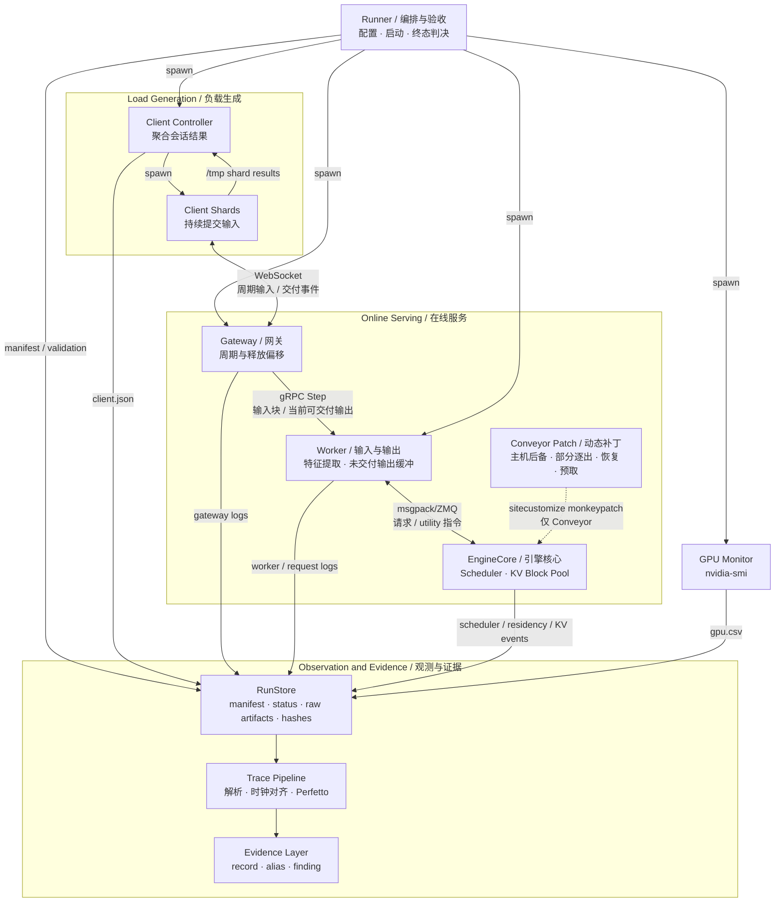

# System

## Design Goals

Conveyor 在普通 continuous-batching 接口之外使用两个工作负载事实：会话是周期性的，以及每个会话预计在何时再次使用 KV cache。系统目标是在保持完整上下文的同时降低空闲会话的 GPU KV 驻留，并避免把大量恢复流量集中到同一短窗口。

设计遵循以下不变量：

1. 每个会话保留完整逻辑上下文，不用有损滑动窗口换取容量；
2. 每个会话的周期保持为 \(T\)，释放偏移只改变周期内的位置；
3. KV 逐出只发生在 resumable request 已进入 idle 后；
4. GPU block pool 是物理驻留的唯一真相，控制 registry 不复制 block 状态；
5. 主机后备覆盖必须显式记录；没有主机副本的逐出块只能在恢复时重算；
6. KV 预取只能改善时序，拒绝、迟到或被 LRU 逐出时必须安全退化为按需恢复或重算；
7. 初始上下文构造在开始周期输入之前完成，不与普通周期更新交错；
8. 每个已启用机制必须产生独立观测事件，patch 加载失败必须终止 run。

实验配置和当前结果分别由 [`Experiments`](experiments.md) 与 [`Findings`](findings.md) 持有；本文不复制性能数字。

## System Topology



在线请求路径是 `Client Shards → Gateway → Worker → EngineCore`。runner 只负责启动、终态判决和 artifact 登记，不进入数据面。精确组件和动态调用边分别由 [`system-map.json`](agent/system-map.json) 与 [`dynamic-edges.json`](agent/dynamic-edges.json) 持有。

## Evaluated Systems

### Upstream Metronome

第三方 pin 中的 Upstream Metronome 保留原始 gateway 和 worker，只作为上游行为参考。它不接受本仓为了公平观测加入的 input-processing 和 trace 修复，因此不能与 Conveyor 的所有数字直接混用。

### Matched Metronome Baseline

正式比较计划使用 matched Metronome baseline：模型、输入、配置的输出上限和 observation producer 与 Conveyor 对齐；`paringest` 修复 host-side input processing，并加入逐会话交付记录。它不改变默认的全 GPU KV 驻留语义。

当前 matched baseline 每段实际最多 decode \(M+8\)，而 Conveyor 配置为最多 \(M\)。两者 offered input 和配置上限来源相同，但 executed decode work 不同；在该缺陷通过独立实验事务修复并重跑前，文档不得称它们执行了完全相同的 workload。

### Conveyor

Conveyor 当前研究三项候选机制：

| 机制 | 对象与动作 | 所属层 |
| --- | --- | --- |
| 释放偏移调度（release-offset scheduling） | 为周期会话分配不同释放偏移，分散多会话需求 | Gateway |
| 带主机后备的 KV 部分逐出（partial KV eviction with host backing） | 增量复制完成块，并在会话 idle 后逐出选定 GPU KV 尾块 | EngineCore |
| KV 预取（KV prefetching） | 在预计复用前把 host-backed blocks 放入 GPU prefix cache | Worker + EngineCore |

worker 的无等待 `Step` 是当前实现选择：它提交当前输入后快照未交付输出缓冲，不等待本次计算。该选择避免一个慢 RPC 阻塞之后的释放槽，但可以被独立输出流等实现替代，因此不进入机制或贡献列表。

## Release-Offset Scheduling

会话 (i) 的第 (k) 次释放发生在：

```text
r(i, k) = r(i, 0) + kT
phi(i) = r(i, 0) mod T
```

gateway 使用绝对时间网格，并在会话建立时分配稳定的 \(\phi_i\)。一次晚醒只影响当前 firing，下一次仍回到原绝对网格，不累积重锚漂移。

每个周期会话在两次使用之间本来就有复用间隔。释放偏移不创造该间隔；它把原本同步的 input processing、engine admission、compute 和潜在 KV restore demand 分散到周期内。当前证据直接验证了 input-processing 惊群的缓解；KV 恢复带宽的平滑效果需要新的 trace 和资源模型验证。

## KV State Model

系统不用一个单一 lifecycle 混合多个对象。一次会话的状态由以下正交事实描述：

| 对象 | 状态或属性 | 真相来源 |
| --- | --- | --- |
| Session | `active`：当前输入已进入 scheduler；`idle`：本段停止并等待下一输入 | scheduler transition |
| GPU KV block | GPU-resident 或不在 GPU prefix cache | GPU block pool |
| Host KV block | host-backed 或尚无主机副本 | host block pool |
| Transfer | none、prefetch in flight、on-demand reload in flight | connector event + control registry |
| Request ownership | request-owned，或 cached-free 可由 prefix match 复用 | KV cache manager |

GPU-resident 与 host-backed 不是互斥状态：同一个 block 可以同时存在于两处。`active` 也不保证所有历史 blocks 已经 GPU-resident，因为 scheduler admission 后仍可能进行 on-demand reload 或重算。控制 registry 只保存 session activity、prefetch 是否在途/延迟以及时间戳；物理 block 状态始终实时查询 pool。

## Partial KV Eviction

### Incremental Host Backing

vLLM 的 `SimpleCPUOffloadConnector` 随引擎迭代把已完成 KV blocks 复制到 host block pool。Conveyor 修复 streaming re-entry 下的 store cursor，使复制前沿继续覆盖新增的完整 blocks。由于 copy confirmation 滞后于生成，最新 block 可能尚未 host-backed；系统为此记录 host coverage，而不假定后备总是完整。

### Idle-Session Eviction

当 resumable request 完成本段生成并进入 idle 时，主路径执行：

1. `free(request)` 释放 request 对所有 GPU blocks 的所有权，使仍有 hash 的 blocks 成为 cached-free；
2. 保留最多 \(K\) 个 GPU prefix blocks，并为尚未发出 host copy 的最新尾部保留实现级 margin；
3. 对选定尾块调用 `evict_blocks`，移除其 GPU cache entry；
4. 记录逐出数量、逐出前所有权、GPU pool 变化和其中已有主机副本的数量。

逐出操作当前不会先把目标集合裁剪到 host-backed blocks。若某个逐出块尚无主机副本，下一次恢复在该缺口处退化为重算。这是已知实现限制，不能把“with host backing”读成所有逐出块都已得到恢复保证。

固定尾块模式通过延迟 utility RPC 逐出指定数量，只用于受控实验。retained-prefix 主路径直接挂在 scheduler 的 idle transition 上，不依赖 worker timer。

### On-Demand KV Reload

下一输入进入 scheduler 时，vLLM 按 block hash 先复用仍在 GPU prefix cache 的前缀，再从 host block pool 加载连续命中的缺失 blocks。首个既不 GPU-resident 也不 host-backed 的 gap 之后只能重算。加载中的 request 使用原生 `WAITING_FOR_REMOTE_KVS` 状态；Conveyor 只增加观测，不改该正确性路径。

## KV Prefetching

当 gateway 释放一个会话输入时，worker 可以调用 `prefetch_kv`。EngineCore 实时查询 block pools；若存在 host-backed 的 GPU 缺口且容量闸允许，就在输入 feature extraction 同期发起 host-to-device copy。完成后 blocks 以原 hash 注册到 GPU prefix cache，下一次 scheduler admission 使用普通 prefix match。

合成 transport ID、如何接入 load event 以及 hash registration 都是当前实现选择，不是独立研究机制。若容量不足，prefetch 被延迟到后续 partial eviction 释放空间；若真正输入先到，则取消延迟项并交给 on-demand path。已完成但尚未复用的 prefetched blocks 仍可被 LRU 逐出，因此预取不改变正确性。

## Output Delivery

matched baseline 和 Conveyor 都维护每会话未交付输出缓冲 `st.tokens[st.consumed:]`。差异是：matched baseline 在没有可交付 token 时最多等待配置的 RPC budget，Conveyor 当前只做一次快照并立即返回。

protobuf 字段 `tokens_per_tick` 与内部短名 `tpt` 是继承的接口标识；在本项目语义中它们表示每周期最多消费的 output-token cap \(M\)，不是最低交付要求。`delivered < M` 可以作为实现诊断记录，但不能单独判定 workload correctness、音频卡顿或论文级 deadline miss。

如果生成速率长期高于 gateway 消费速率，未交付输出缓冲会持续增长。这个现象必须记录，但最终论文采用何种 freshness 或 QoE metric 由 evaluation 设计决定。

## Initial-Context Preloading

初始上下文预加载（initial-context preloading）是实验状态构造，不是 Conveyor 机制。runner 在开始周期输入前预建指定会话，完成所有 initial-context prefills，并把初始化产生的单个输出 token 从交付游标中跳过。

Conveyor 在该屏障期间暂停 automatic KV eviction。屏障结束时只解除暂停，不立即逐出，因为 host-backing frontier 可能尚未覆盖整个初始上下文；第一次正常周期计算后，scheduler 的 idle transition 再建立 retained-prefix 状态。`initialization barrier timed out` 必须使 run validation 失败。

## One Session Cycle

| 阶段 | 对象与动作 | 新 artifact | 健康检查 |
| --- | --- | --- | --- |
| Release | gateway 在绝对网格释放会话输入 | `gateway_ticks.log` | 周期不漂移，offset 稳定 |
| Input and output | worker 入队 input chunk，并快照当前未交付输出 | `P`、`deliv` | RPC 不阻塞后续 release slot |
| Feature extraction | input 进入线程池并生成模型特征 | `IQ/IS/IE/IR/IA` | queue、FE、handoff 可分解 |
| Scheduler admission | 新特征追加到 resumable request | scheduler/request events | session ID 连续有效 |
| KV restore | prefix match 后执行 prefetch hit、on-demand reload 或重算 | `L/R`、large prefill | 缺失历史最终恢复 |
| Prefill and decode | 引擎执行当前 input 与最多 \(M\) 个输出 token | `scheduler.log` | 无 session death |
| Host backing | 新完成 blocks 推进 host-backing frontier | `B` in `kv_events.log` | 前沿继续增长 |
| Partial eviction | session idle 后逐出选定 GPU tail | `E` + residency counter | idle prefix 有界、coverage 可审计 |

## Observability Model

新 run 的 KV 事件统一写入 `kv_events.log`：

```text
E  partial KV eviction
B  host-backing frontier advancement
L  on-demand reload or prefetch issued
R  corresponding load completed
```

`residency.log` 从 GPU pool 采样每会话 block 数；`scheduler.log` 记录引擎调度迭代；`per_request.log` 连接 release、feature extraction 与 admission；`gateway_ticks.log` 记录绝对网格、RPC 延迟和实际交付量。Perfetto 只可视化这些已采集事件，不能把相邻 scheduler 调用间隔伪装成精确 GPU kernel 时间。

旧 `results/` 中的历史 artifact 仍由其产生时的 commit 和 schema 解释；新 parser 不用废弃术语为旧日志维持第二套当前语义。
