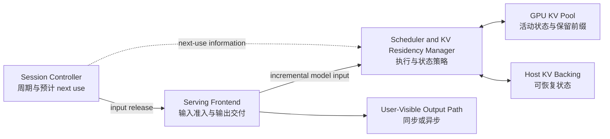

# System

## Design Goals

Conveyor 使用周期性交互会话提供的两个工作负载事实：会话会被重复使用，以及下一次使用时刻具有可预测性。系统目标是在保持完整逻辑上下文的同时降低空闲会话的 GPU KV 驻留，并避免把大量恢复工作集中到更新已经进入关键路径之后。

设计遵循以下不变量：

1. 每个会话保留完整逻辑上下文，不用有损截断换取容量；
2. 每个会话的周期保持为 \(T\)，释放偏移只改变周期内的位置；
3. KV 逐出只作用于已经进入 idle 的会话；
4. 物理 KV allocator 是 GPU 驻留状态的唯一真相，控制面不维护可能漂移的影子副本；
5. 主机后备覆盖必须显式可知；缺少主机副本的状态在再次使用时通过重算恢复；
6. KV 预取只改变恢复时序，不改变正确性；拒绝、迟到或预取状态再次被逐出时，系统安全退化为按需恢复或重算；
7. 模型执行进度和用户可见交付进度是不同对象，KV residency policy 不依赖某一种 output-delivery interface；
8. 测量状态构造（如初始上下文预加载）在周期输入开始前完成，不与正常周期更新交错；
9. 每个已启用机制必须产生可区分的观测事件。

实验配置和当前结果分别由 [`Experiments`](experiments.md) 与 [`Findings`](findings.md) 持有；本文只定义机制语义、状态关系和正确性边界，不复制平台、runner、比较对象或性能数字。

## Logical Architecture



会话控制层提供周期和预计 next use；serving frontend 负责把增量输入交给引擎，并通过可替换的 output path 交付结果；scheduler 与 KV residency manager 共同决定哪些状态留在 GPU、哪些状态具有主机后备，以及何时逐出或恢复。这个逻辑分层不要求特定进程边界或 IPC。当前代码入口、subprocess、动态补丁和调用边由 [`system-map.json`](agent/system-map.json) 与 [`dynamic-edges.json`](agent/dynamic-edges.json) 持有。

## Research Mechanisms

Conveyor 研究三项可独立消融的候选机制。evaluated systems 的完整清单、配置与比较资格由 [`Experiments`](experiments.md#evaluated-systems) 持有；本节只定义机制语义。

| 机制 | 使用的信息 | 改变的系统行为 |
| --- | --- | --- |
| 释放偏移调度（release-offset scheduling） | 周期与每会话释放位置 | 把原本同步的输入、计算和恢复需求分散到周期内 |
| 带主机后备的 KV 部分逐出（partial KV eviction with host backing） | 会话 idle 状态、GPU 驻留与主机覆盖 | 保留有限 GPU prefix，逐出空闲会话的其余 KV tail |
| KV 预取（KV prefetching） | 预计 next use、恢复需求与可用 GPU capacity | 在真正准入前尽早恢复可复用的 host-backed KV |

output delivery、transport、cache-key 注册、状态缓冲和观测注入可以影响测量语义或工程开销，但它们不改变上述因果假设，因而不是第四项机制。

## Release-Offset Scheduling

会话 \(i\) 的第 \(k\) 次逻辑释放满足

\[
r_{i,k} = r_{i,0} + kT, \qquad \phi_i = r_{i,0} \bmod T.
\]

系统为会话保持稳定的 \(\phi_i\)，并以绝对时间网格解释后续释放；一次迟到不应把之后所有释放永久重锚到新的相对时间。每个周期会话在相邻两次使用之间本来就有复用间隔，释放偏移不创造该间隔，只改变多个会话在周期内的重叠结构。

同步释放与偏移释放的对比（示意）：

```text
all sessions fire at the same instant:
  s1  ██████........................
  s2  ██████........................
  s3  ██████........................
  s4  ██████........................
      ▲ burst: input processing, compute and KV restores collide

release offsets phi(i) spread the firings:
  s1  ██████........................
  s2  ........██████................
  s3  ................██████........
  s4  ........................██████
      same total work, lower peak demand at every instant
```

该示意画的是服务窗口互不重叠的低并发情形。当 \(N\) 超过 \(T\) 与单会话服务时长之比时，相邻窗口自然重叠，continuous batching 会把重叠的服务合并成批；偏移改变的是峰值结构与各会话切分输入的时刻；每周期的恢复字节数与生成 token 数不变，但错开降低瞬时批量，权重在一个周期内被读取的次数随之增加。

机制主张因此不是“offset 总能提速”，而是利用稳定 release structure 在 capacity、compute 和 restore bandwidth 之间选择更合适的工作点；实际收益及代价必须分别测量，各项收益的当前证据状态由 [`FINDING-D3`](findings.md#finding-d3) 与 [`FINDING-H1`](findings.md#finding-h1) 持有。

## KV State Model

系统把会话活动、物理驻留、主机覆盖、传输和所有权视为正交状态，而不是压缩为一个含糊的 session lifecycle：

| 对象 | 状态或属性 | 权威来源 |
| --- | --- | --- |
| Session | `active` 或 `idle` | serving scheduler 的会话状态 |
| GPU KV block | GPU-resident 或 absent | GPU KV allocator |
| Host KV block | host-backed 或 uncovered | host-backing allocator |
| Transfer | none、prefetch in flight 或 on-demand restore in flight | transfer subsystem |
| Allocation ownership | active-request-owned 或可由缓存复用 | runtime request 与 KV allocator |

GPU-resident 与 host-backed 不是互斥状态，同一个 block 可以同时存在于两处。`active` 也不意味着全部历史 KV 已经在 GPU 上；准入仍可能等待恢复，或者对没有后备覆盖的部分执行重算。控制面可以记录策略状态和时间，但物理 block 状态必须从相应 allocator 实时取得。

## Partial KV Eviction

一个 idle 会话在逐出后的 block 视图（block 从旧到新）：

```text
                 0            K                            F               n
                 ├── prefix ──┼────────── middle ──────────┼─ fresh tail ──┤
kept on GPU      │ yes        │ no, evicted                │ yes           │
host copy        │ yes        │ yes                        │ not yet       │
at next input    │ prefix hit,│ copied back: early         │ used in       │
                 │ free       │ (prefetch) or on demand    │ place         │

K: retained GPU prefix   F: host-backing frontier   n: newest block
the tail stays on GPU as margin until its host copy is confirmed
```

以下小节分别定义 host-backing frontier 的推进、逐出的选择规则和恢复路径。

### Incremental Host Backing

随着上下文增长，系统逐步把已经完成的 KV blocks 复制到主机后备。复制完成可能落后于模型执行，因此最新 KV tail 不一定已经 host-backed；系统必须记录连续覆盖范围，而不能从“启用了 offload”推断所有状态都可直接回载。

主机副本与 GPU 副本可以并存。建立主机后备本身不释放 GPU capacity；只有 idle-session eviction 改变 GPU 驻留量。

### Idle-Session Eviction

当一次更新完成且会话进入 idle 后，系统执行以下逻辑动作：

1. 解除活动请求对其 KV blocks 的独占所有权，使可保留状态能够由缓存复用；
2. 保留至多 \(K\) 个 GPU prefix blocks，作为下一次使用的驻留前缀；
3. 从 GPU KV pool 逐出选定 tail，并保留其主机覆盖信息；
4. 让释放出的 capacity 能被其他活动会话或提前恢复使用。

\(K\) 是容量与恢复成本之间的策略参数，不是硬件常数。为了正确性，逐出只发生在 idle 状态；为了证据可解释性，逐出量、主机覆盖和物理 residency change 必须能够分别观察。

### On-Demand Restoration

下一次输入准入时，引擎先复用仍然 GPU-resident 的连续前缀，再恢复连续 host-backed 的缺失 blocks。首个既不 GPU-resident 也不 host-backed 的 coverage gap 及其后续依赖状态通过重算恢复。这样，主机覆盖不完整会增加执行成本，但不会让系统错误地宣称完整 reload 已经发生，也不会改变模型可见的逻辑上下文。

## KV Prefetching

KV 预取利用预计 next use，在输入真正进入模型执行前发起 host-to-device 恢复。预取 lead time 可以由 release structure 和资源状态决定；它不要求某一种 frontend 调用时机。只有当目标 blocks 确实 host-backed 且 GPU 有安全容量时，恢复结果才进入可复用的 GPU cache。

如果容量暂时不足，预取可以延后；如果真实输入先到，系统转入按需恢复；如果已预取状态在使用前被正常缓存策略逐出，后续仍按普通缺失状态处理。capacity deferral、input overtaking 和 later eviction 因而只影响性能，不破坏正确性。

## Output Delivery

KV residency policy 管理模型继续执行所需的历史状态；output-delivery architecture 管理已产生结果何时、以何种形式对用户可见。这两个问题相互影响端到端 latency，却没有机制上的从属关系。系统可以使用同步返回、异步流、缓冲消费或额外媒体处理，而不改变释放偏移、部分逐出和 KV 预取的定义。

因此，frontend 调用返回、模型生成推进和用户可见结果推进必须分别观察。任何 latency 或 freshness 指标都要明确起点、终点和跨层关联，不能把“调用仍在返回”直接当成“当前输入已经产生并交付了新结果”。当前实现采用的 delivery path 及其指标口径只在 [`Experiments`](experiments.md) 中定义。

## Initial-Context Preloading

初始上下文预加载（initial-context preloading）是实验状态构造，不是研究机制。系统在开始周期输入前预建指定会话的上下文状态，完成全部 initial-context prefills；状态构造期间产生的输出不计入正常周期交付。配置入口与超时判定由 [`Experiments`](experiments.md#initial-context-preloading) 持有。

Conveyor 在该构造屏障期间暂停 automatic KV eviction。屏障结束时只解除暂停，不立即逐出，因为 host-backing frontier 可能尚未覆盖整个初始上下文；第一次正常周期计算后的 idle transition 再建立 retained-prefix 状态。

## One Session Cycle

| 逻辑阶段 | 状态变化 | 正确性要求 |
| --- | --- | --- |
| Next-use planning | 根据周期和资源状态决定是否提前恢复 | 不改变会话周期；失败可退化 |
| Release | 新输入在应用层变为可提交 | 保持稳定 release structure |
| Admission | 新输入追加到同一逻辑会话 | 保留完整上下文身份 |
| KV preparation | 复用 GPU prefix，恢复 host-backed 缺口，重算 uncovered suffix | 准入前得到正确历史状态 |
| Model execution | 对新增输入执行 prefill 和后续生成 | 模型进度可独立观察 |
| Host backing | 推进新增完整 blocks 的主机覆盖 | 不假设覆盖与生成同步完成 |
| Idle transition | 当前更新停止占用活动执行状态 | 逐出只在该转换后发生 |
| Partial eviction | 保留 GPU prefix 并释放选定 tail | 物理驻留变化与主机覆盖可区分 |

用户可见输出可能跨越多个逻辑阶段异步推进，因此不被强行放进一个与 KV 状态一一对应的阶段。

## Observability Model

为验证机制而不是某个实现字段，观测必须至少区分：

- 应用级 release、serving admission 与 engine execution；
- 会话 `active` / `idle` 转换；
- GPU residency 与 host-backing coverage；
- eviction、prefetch、on-demand restore 与 recomputation；
- model progress 与 user-visible delivery；
- liveness、failure 和观测缺失。

具体事件名、artifact schema、采样方法和 validation 属于 [`Experiments`](experiments.md)、agent registries 与 `results/` 契约。可视化只能表达已经采集的事件，不能从相邻软件事件间隔推断未测量的 GPU kernel 时间。
